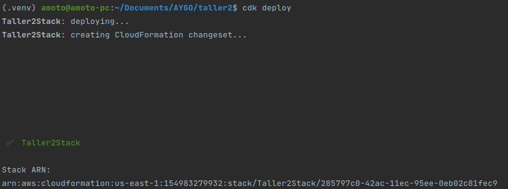
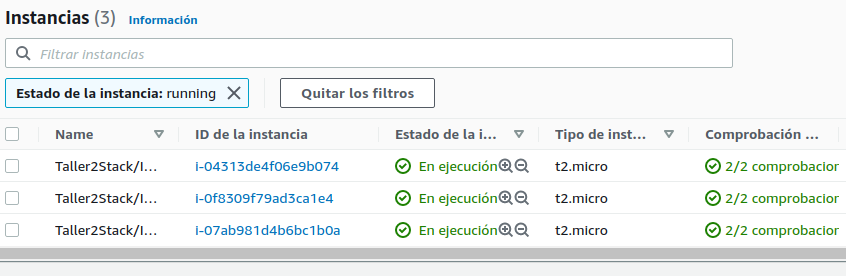
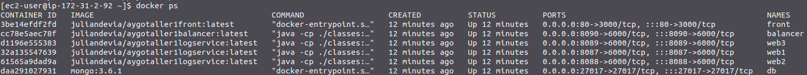
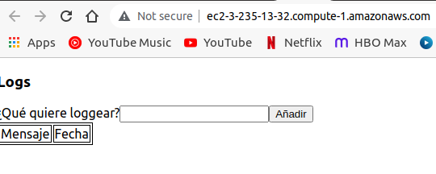

# Taller 2 AYGO

En este taller se muestra una aplicación hecha con amazon CDK en el lenguaje python para desplegar la aplicación desarrollada en el [taller 1](https://github.com/amoto/AYGO-taller1) en 3 instancias de AWS EC2. 

## Requisitos

- [x] AWS cli
- [X] Python 3
- [X] NPM
- [x] Cuenta de AWS
- [x] AWS VPC
- [x] AWS Security group
- [x] AWS Key pair

## Configuración del entorno

### Inicializar una aplicación para CDK

- Instalar aws CDK `npm install -g aws-cdk`
- Instalar pip `sudo apt-get install python3-pip`
- Actualizar pip `python3 -m pip install --upgrade pip`
- Instalar venv `sudo apt install python3.8-venv`
- Actualizar venv `python3 -m pip install --upgrade virtualenv`
- Inicializar la aplicación de cdk para python `cdk init app --language python`
- Activar el venv de python3 `source .venv/bin/activate`
- Instalar las dependencias necesarias `python -m pip install -r requirements.txt`

### Desarrollo de la aplicación

El archivo [taller2/taller2_stack.py](taller2/taller2_stack.py) contiene la definición del stack con el que se realizará el despliegue.
Este stack está compuesto por el rol que poseerán las instancias, el security group al que pertenecerán (con los puertos 22, 80 y 8090 abiertos a internet) y la vpc en la que estarán ubicadas.

En las configuraciones de inicio de las instancias que se especifican en el stack se siguen los pasos esenciales definidos en la aplicación a desplegar, se instala git, docker, docker-compose, se clona el repositorio y se ejecuta docker-compose para iniciar los componentes necesarios. 

El archivo [app.py](app.py) es desde donde se instanciará el stack con las configuraciones que se van a usar las cuales serán:

- key_name: El nombre de la pareja de llaves que se usará para conectarse a las instancias
- vpc_id: El id de la VPC en la que se encontrarán las instancias cuando se creen
- sg_id: El id del security group que cubrirá las instancias
- account: El id de la cuenta de AWS 
- region: La región en la que se crearán las instancias y donde se encuentran la VPC y el security group

## Despliegue del stack

Para desplegar el stack se ejecuta el comando `cdk deploy` desde el ambiente virtual de python3.

Luego desde la consola de administración de aws es posible ver las 3 instancias creadas.

Al entrar a una de estas instancias y ejecutar el comando `docker ps` se puede observar que los contenedores de [taller 1](https://github.com/amoto/AYGO-taller1) se encuentran en ejecución.

Desde el DNS público de una de las instancias accediendo por el protocolo http y por el puerto 80 desde un explorador web se puede ver la aplicación en ejecución.

